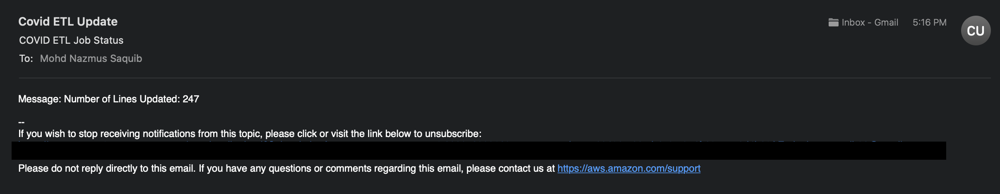
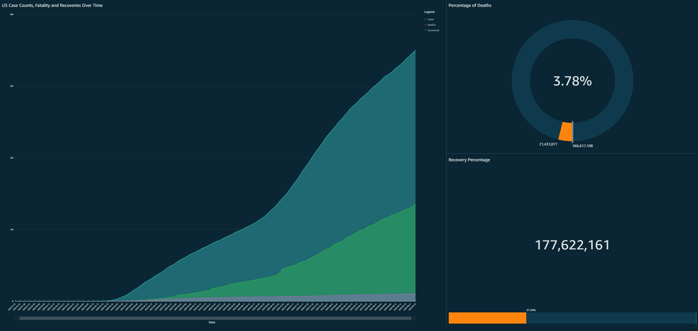

# #CloudGuruChallenge - Event-Driven Python on AWS :cloud:
AWS Challenge by A Cloud Guru

## Challenge Link :link:
[Cloud Guru Challenge](https://acloudguru.com/blog/engineering/cloudguruchallenge-python-aws-etl)

## Challenge Goal :goal_net:
Automate an ETL processing pipeline for COVID-19 daat using Python and AWS Cloud Services

## Project Architecture :wrench:

The following image displays the entire architecture developed using THE SERVERLESS FRAMEWORK

## Tech Stack :construction_worker:
The following tech stacks were used:
1. Python
1. AWS
1. The Serverless Framework
1. Github

## Services :truck:
The following AWS Services are used for this project:
1. S3 Bucket
1. Glue Crawler
1. Glue Database
1. IAM Roles
1. DynamoDB Table
1. Cloudwatch Event Rule
1. Lambda Function
1. Cloudwatch Logs
1. SNS Subscription
1. SNS Topic

## Tests :hammer_and_wrench:
Used Python's built-in module, Unittest, to perform some simple tests, to ensure that the code can handle unexpected situations and subsitute invalid data.

## SNS Email :email:
Depending on the result of the process, a notification will be sent out to all the subscribers through AWS SNS

## QuickSight Dashboard :trophy:
Dashboard developed using Quicksight and Data retrived from Athena

## Blog Link! :book:
Blog Post: [Blog About this Project](https://mohdsaquib.hashnode.dev/event-driven-covid-19-data-etl-process-acloudguruchallenge)
#### Got Questions? :question:
Feel free to email me at *nsaquib96@gmail.com*