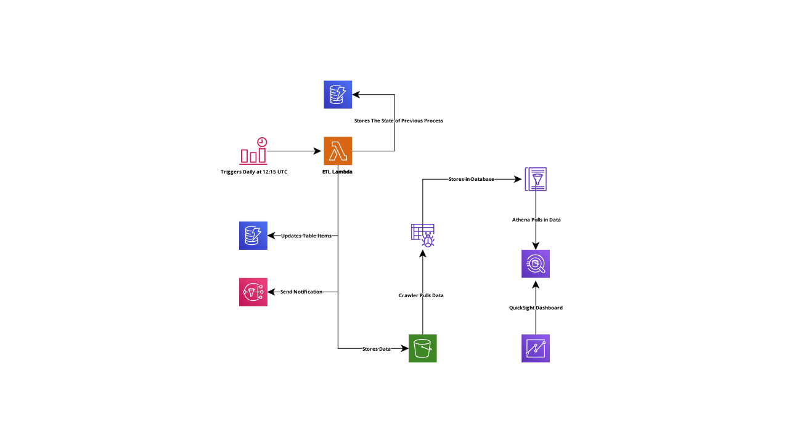
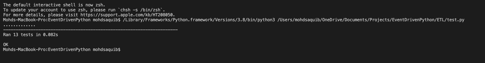

# #CloudGuruChallenge - Event-Driven Python on AWS
AWS Challenge by A Cloud Guru

## Challenge Goal
Automate an ETL processing pipeline for COVID-19 daat using Python and AWS Cloud Services

## Project Architecture :wrench:

The following image displays the entire architecture developed using THE SERVERLESS FRAMEWORK

## Services :truck:
The following AWS Services will be created:
1. S3 Bucket
1. Glue Crawler
1. Glue Database
1. IAM Roles
1. DynamoDB Table
1. Cloudwatch Event Rule
1. Lambda Function
1. Cloudwatch Logs
1. SNS Subscription
1. SNS Topic

## Tests :hammer_and_wrench:
Used Python's built in module, Unittest, to perform some simple tests, to ensure that the code can handle unexpected situations and subsitute invalid data.

## How to Use? :clipboard:

### Prerequisites :book:

### Steps! :rocket:

# Blog Post! :book:

#### Got Questions? :question:
Feel free to email me at *nsaquib96@gmail.com*