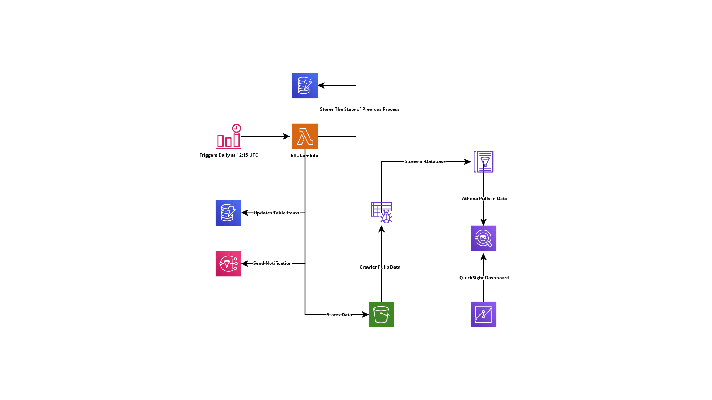

# #CloudGuruChallenge - Event-Driven Python on AWS

## Challenge Goal
Automate an ETL processing pipeline for COVID-19 daat using Python and AWS Cloud Services

## Project Architecture :wrench:

The following image displays the entire architecture developed using THE SERVERLESS FRAMEWORK

